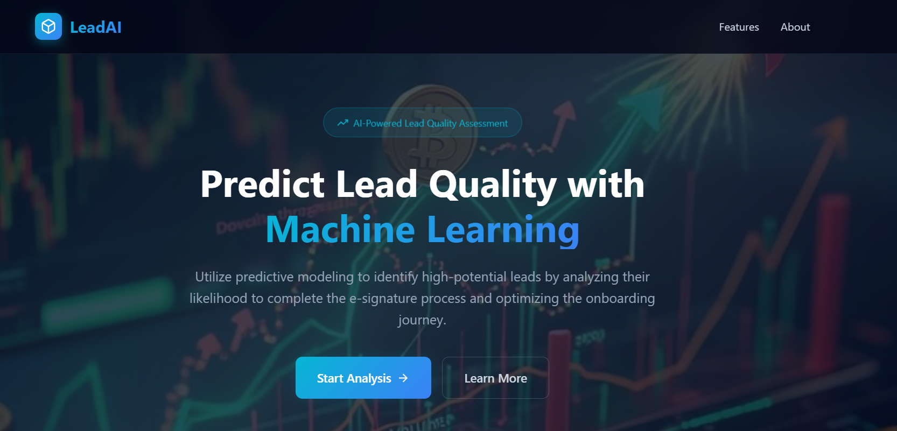
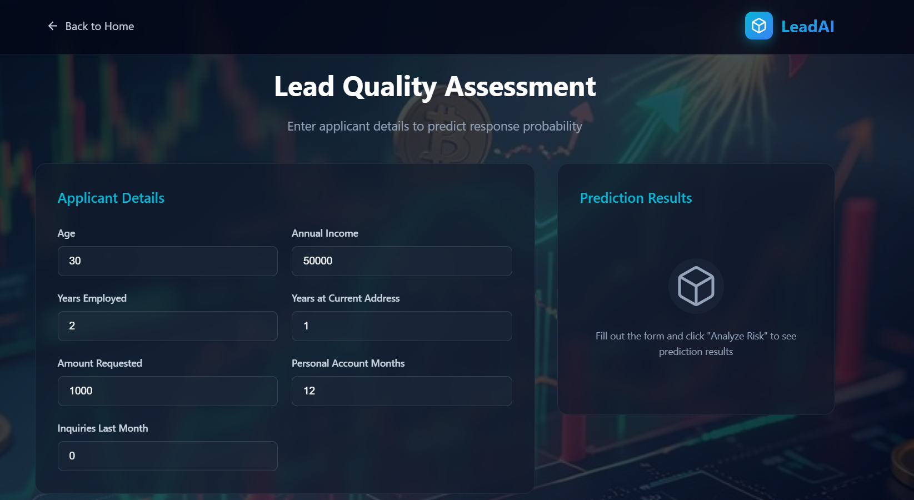
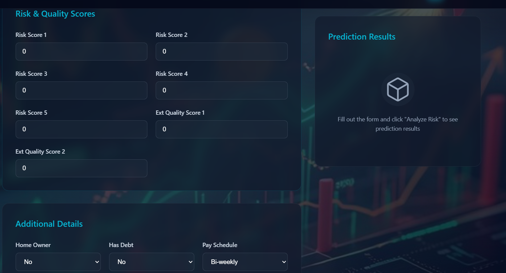
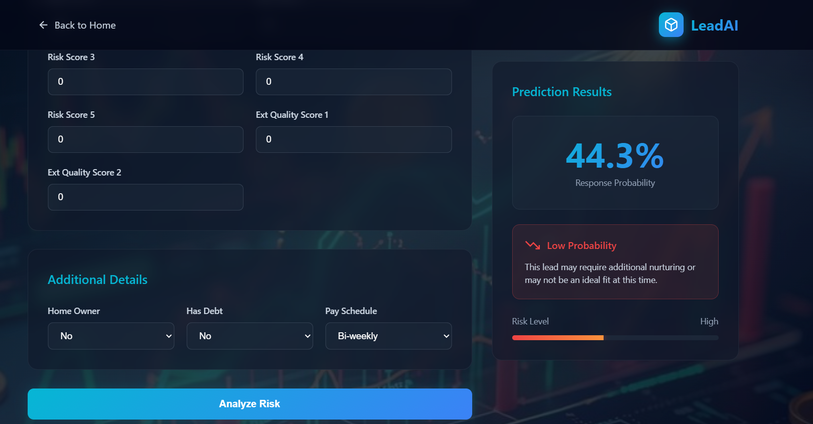

#  LeadAI – Predicting E-Signature Likelihood in FinTech

##  Predicting the Likelihood of E-Signing a Loan Based on Financial History

LeadAI is a **machine learning–based lead quality assessment system** built for FinTech loan application use cases.  
It predicts whether a loan applicant will successfully complete the **e-signature stage** of the onboarding process using a combination of **financial, risk, and behavioral indicators**.

The dataset used is **synthetic but highly realistic**, generated from trends observed in real-world FinTech case studies.  
Although artificially created, the feature distributions and relationships closely reflect industry-level loan applicant behavior.

---

# Project Overview

Modern lending companies receive loan applicants from peer-to-peer marketplaces such as:

- Upstart  
- LendingTree  
- LendingClub  

However, **not all leads are equally valuable**. Many applicants drop out before completing the process.

LeadAI helps predict which applicants are most likely to finish onboarding by completing the e-signature step, enabling better:

✅ Targeting  
✅ Lead prioritization  
✅ Conversion optimization  

---

# Business Problem

The company needs to identify applicants who will:

- Complete the electronic signature stage (**e_signed = 1**)

This step marks the end of the user-controlled onboarding flow.  
After e-signing, the loan approval process is fully handled internally.

Therefore, predicting **e_signed** becomes a direct measure of **lead quality**.

---

#  Key Features

## Applicant Details

- Age  
- Annual Income  
- Years Employed  
- Years at Current Address  
- Amount Requested  
- Personal Account Months  
- Inquiries in Last Month  

---

##  Risk & Quality Scores

- Risk Score (1–5)  
- External Quality Score 1  
- External Quality Score 2  

---

##  Additional Information

- Home Owner (Yes/No)  
- Has Debt (Yes/No)  
- Pay Schedule (Weekly, Bi-weekly, Monthly)  

---

#  Machine Learning Workflow

1. Exploratory Data Analysis (EDA)  
2. Data Cleaning & Preprocessing  
3. Feature Engineering  
4. Model Training  
   - Logistic Regression  
   - Decision Tree  
   - Support Vector Machine (SVM)  
5. Model Evaluation  
6. Hyperparameter Tuning  
   - Grid Search  
   - Cross Validation  
7. Final Probability Prediction Output  

---

#  Web Application

The LeadAI web interface allows users to:

- Enter applicant details  
- Add financial risk and quality scores  
- Click **Analyze Risk**  
- View enrollment probability and lead risk level instantly  

---
## Application Screenshots

### 🔹 Landing Page  

---

### 🔹 Applicant Data Input Form  

---

### 🔹 Risk & Quality Score Entry  

---

### 🔹 Prediction Result Output  

---

#  Use Case

**Market:** FinTech loan applicants from intermediary platforms  
**Product:** Loan and credit services  
**Goal:** Predict lead quality and improve conversion rates  

This helps businesses:

- Reduce wasted leads  
- Improve onboarding flows  
- Increase response and approval rates  
- Optimize marketing and targeting strategies  

---

# Technologies Used

- Python  
- Pandas  
- NumPy  
- Scikit-learn  
- Matplotlib  
- Seaborn  
- Jupyter Notebook  
- LeadAI Web UI  

---

#  Why This Project Matters

Financial and loan applicant datasets are rarely clean, balanced, or predictable.  
LeadAI reflects real-world FinTech challenges and demonstrates how machine learning can support smarter, faster, and more efficient decision-making in modern lending systems.

